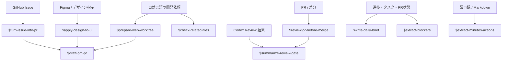

# Prompt Skill Map

clapboard でよく使うプロンプトを repo-local skill として `.codex/skills/` に整理した一覧。

| Skill | 分かりやすい名前 | 元になったプロンプト / 運用 |
| --- | --- | --- |
| `$prepare-web-worktree` | Webワークツリー化 | Webから自然言語で実装依頼 |
| `$turn-issue-into-pr` | Issue修正PR化 | GitHub IssueをAI作業に変換 |
| `$apply-design-to-ui` | デザインUI反映 | Figma指示からUI反映 |
| `$review-pr-before-merge` | PR事前レビュー | `scripts/codex-pr-review.sh` のレビュー指示 |
| `$summarize-review-gate` | レビュー判断整理 | PRレビュー結果をPM判断に変換 |
| `$write-daily-brief` | 日次状況整理 | 今日の報告を作成、レビュー待ちPRを整理 |
| `$extract-blockers` | ブロッカー抽出 | 新着ブロッカーを抽出 |
| `$check-related-files` | 関連ファイル確認 | 関連ファイルを確認 |
| `$extract-minutes-actions` | 議事録アクション抽出 | 議事録生成プロンプト集、議事録レビュー |
| `$draft-pm-pr` | PM向けPR本文作成 | PR本文テンプレート |
